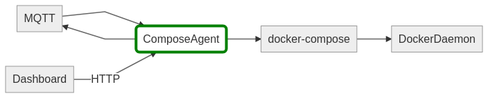

# Architecture

## Purpose
The purpose of this service is to translate requests for starting and stopping of instances to the appropriate [Docker Compose](https://docs.docker.com/compose/) commands.
The second goal is to add aditional functionality on top of Docker Compose, like:

- Storage buckets
- Networking
- Security



## Features

### Storage buckets
The agent automatically chroots volume mappings of a Docker Compose file to a project and bucket specific base folder. Both relative and absolute paths will be chrooted.

The example demonstrates the rewrite process. In this example the base folder is `/shared/data/my_project` and the bucket name is `my-website`.

```
version: 2.0
services:
  www:
    image: nginx
    volumes:
      - ./website:/usr/share/nginx/html

# will rewritten as:

version: 2.0
services:
  www:
    image: nginx
    volumes:
      - /shared/data/my_project/my-website/website:/usr/share/nginx/html
```

### Networking
The agent makes all containers first-class citizens of a network. It does this by providing a network sidecar container. This container is responsible for acquiring an IP-address. See [ictu/pipes:2](https://github.com/ICTU/pipes). The reason of existence of this sidecar container is because certain tools are necessary in the container to acquire an IP address, of which a DHCP client is the most important one. It is not guaranteed that such tools are readily available in all containers. Furtermore; Docker supports the re-use of the network stack of another container. This way responsibilities are clearly separated. It also allows the agent to make certain assumptions about the functionality available in the sidecar container. Being, in this case, a specific DHCP client.

### Security
The agent limits the use of certain Docker Compose features in order to secure the environment in which the instance is deployed.

The following capabilities are removed:

- cap_add
- cap_drop
- cgroup_parent
- devices
- dns
- dns_search
- ports
- privileged
- tmpfs

## HTTP API

This Agent exposes an HTTP api for starting and stopping of instances and the managemnt of buckets. This API is implemented by the [Agent API](https://github.com/ICTU/agent-api) library. This library can be reused by different Agent implementations as it only implements the API (contract) between the Dashboard and the 'Agent'. 
**The HTTP API is marked as technical debt. See the 'Technical Debt' section below.**


## MQTT

### Subscriptions

This component doesn't subscribe to topics. See the 'Technical Debt' section below.

### Publications

This component publishes information on the following topics

- /network/info

  Periodically publishes information about the network. Example:
  ```
  {
    totalIps: 200,
    usedIps: 31
  }
  ```

- /dhcp/info

  Not implemented.

- /system/memory

  Periodically publishes information about the available memory. Example:
  ```
  {
      free: 4000000000,
      total: 48000000000
  }
  ```

- /system/uptime

  Periodically publishes information about the system uptime.

- /system/cpu

  Periodically publishes information abou the system CPU usage. Example:
  ```
  {
    loadavg: {
      '1min': 0.5,
      '5min': 1,
      '15min': 1.6,
    },
    cpus: {
      count: 8,
      model: "Intel(R) Xeon(R) CPU E5-2670 v3 @ 2.30GHz"
    }
  }
  ```

- /agent/docker/log/startup

  Publishes the startup logs of Docker Compose.

- /agent/docker/log/startup/error

  Publishes any error that occured during the start of Docker Compose.

- /agent/docker/log/teardown

  Publishes the teardown log of Docker Compose.

- /agent/docker/pulling

  Publishes information about pulling Docker images.
  
## Technical debt

This component currently contains some technical debt. Effort has been made to decouple component interactions by introducting MQTT as a message broker. This way all direct HTTP calls have been removed. The only remnant of this pre-MQTT era is the Agent HTTP API. In future developments the agent should accept MQTT messages, replacing the HTTP API completely.
Changing from HTTP to MQTT also impacts the Dashboard, since it calls the HTTP API.
